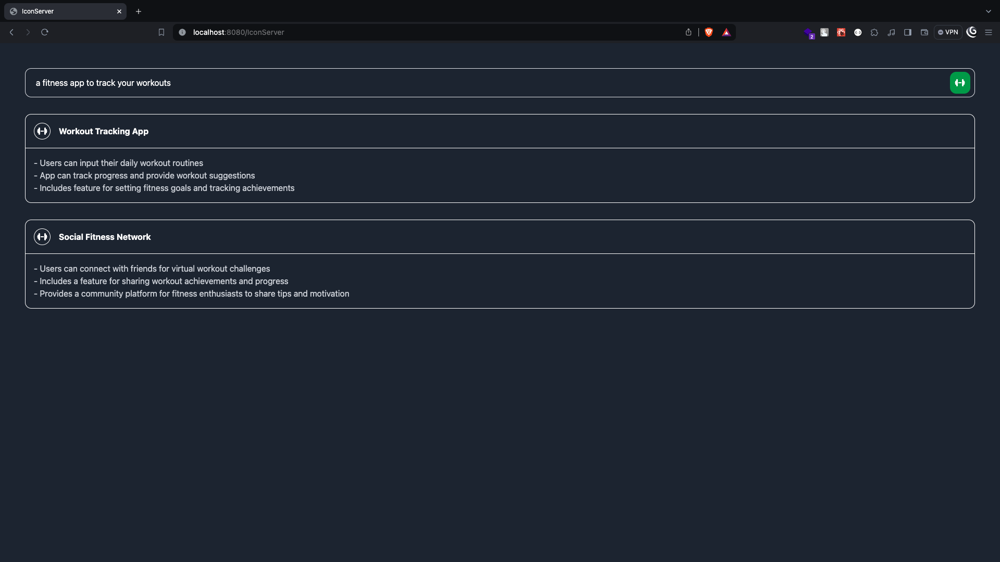

# IconServer



Server repository:
[IconServer-server](https://github.com/CH1NRU5T/IconServer-server)

## Steps to run

- Clone the repository

  ```bash
  git clone https://github.com/CH1NRU5T/IconServer.git
  ```

- Run

  ```bash
  npm install
  ```

- Run

  ```bash
  npm run dev
  ```

- Open `http://localhost:8080` in your browser

## Features

- Enter your ideas in the search field
- This will make a request to the server, which in turn will call the chat-gpt completion API and get 2 things:
  - The icon associated with the idea.
  - The project ideas that are similar to the one you entered.
- The server will then return the icon and the similar ideas to the client.
- Used Redux-Toolkit for state management.
- Used TailwindCSS for styling.
- Used FontAwesome for icons.
  - The server will make sure that the icons that are being given by the chat-gpt API are available in the free-tier of FontAwesome by calling the FontAwesome GraphQL API.

## Github Actions

### There are 2 workflows

- `Deploy to GitHub Pages` - This runs on every push to the main branch, and deploys the client to GitHub Pages.
- `Create Docker Image and Push to Hub` - This runs on every push to the main branch, and creates a docker image and pushes it to Docker Hub.

## Limitations

- The server is deployed on render, and the free-tier will delay the requrests the first time it is made. `Your free instance will spin down with inactivity, which can delay requests by 50 seconds or more.`
- Currently only using free-tier of FontAwesome for icons, which has limited icons available.
